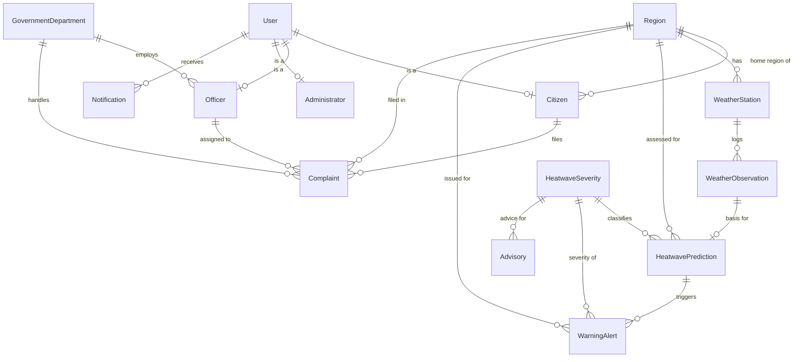

# AI-Based Heatwave Complaint & Early Warning System

A DBMS mini-project: weather monitoring, rule-based heatwave severity
prediction, citizen complaints, automatic warning alerts, and government
response tracking, all in one system.

> **Live demo:** https://agrawalpalak08.github.io/DBMS_mini_project/
> It's a client-side build that runs real SQLite in the browser (via sql.js),
> including the actual schema, trigger and view, so you can click through the
> whole project with no install. The Flask version in this repo is the full
> server-based implementation for the lab — run it with the steps below.

- **Backend:** Python (Flask)
- **Database:** SQLite (single file `heatwave.db`)
- **Frontend:** Server-rendered Jinja2 templates + Bootstrap 5
- **Charts:** Chart.js
- **"AI" module:** a rule-based expert system (threshold rules), no ML libraries — more on this in [section 3](#3-the-rule-based-expert-system-ai-module).

---

## 1. Setup & Run

### Prerequisites
- Python 3.9+ installed.

### Steps

```bash
# 1. (optional) create a virtual environment
python -m venv venv
venv\Scripts\activate        # Windows
# source venv/bin/activate   # macOS/Linux

# 2. install dependencies
pip install -r requirements.txt

# 3. create the database (schema + trigger + view + seed data)
python init_db.py

# 4. run the server
python app.py
```

Then open <http://127.0.0.1:5000> in your browser.

To rebuild the DB from scratch at any time, just run `python init_db.py` again
(it drops and recreates everything). For an empty schema without seed data:
`python init_db.py --schema`.

### Demo login accounts (password: `pass123`)

| Username   | Role          | Notes                          |
|------------|---------------|--------------------------------|
| `admin`    | Administrator | full access, DB admin, reports |
| `officer1` | Officer       | Water Supply department         |
| `officer2` | Officer       | Health department               |
| `priya`    | Citizen       | Nagpur                          |
| `rahul`    | Citizen       | Vidarbha East                   |
| `sana`     | Citizen       | Akola                           |

---

## 2. ER Diagram

Entities, relationships and cardinalities:



**Cardinalities in words**
- A **Region** has many **WeatherStations**; each **WeatherStation** logs many **WeatherObservations**.
- A **Region** has many **HeatwavePredictions** and **WarningAlerts**.
- **User** is the base login table; each user is exactly one of **Citizen / Officer / Administrator** (1:1 sub-type tables).
- A **Citizen** belongs to one **Region** and files many **Complaints**.
- An **Officer** belongs to one **GovernmentDepartment** and is assigned many **Complaints**.
- A **Complaint** links one **Citizen**, one **Region**, and optionally one **Department** + one **Officer**.
- **HeatwaveSeverity** is a lookup table referenced by predictions, alerts, and advisories.
- **Advisory** is a static catalogue of messages mapped to a severity level.
- **Notification** links to one **User**.

---

## 3. The Rule-Based Expert System (AI module)

Located in [`expert_system.py`](expert_system.py). It is a **rule-based / knowledge-based
expert system**, *not* machine learning — this is intentional and matches the course
requirement. Given the latest weather observation it applies fixed IF-THEN rules:

| Severity  | Rule                                                        |
|-----------|-------------------------------------------------------------|
| Extreme   | `temp ≥ 45°C`  **OR**  (`temp ≥ 40°C` **AND** `humidity ≤ 20%`) |
| High      | `temp ≥ 40°C`                                               |
| Moderate  | `temp ≥ 35°C`                                               |
| Low       | below 35°C                                                  |

The result is written to `HeatwavePrediction` (with the rule that fired stored in `reason`).
When severity is **High or Extreme**, a **database trigger** auto-creates a `WarningAlert`,
and the backend attaches a static set of **Advisory** messages for that severity.

---

## 4. Modules

1. **User Management** — register/login for Citizen/Officer/Administrator; role-based access control (each role has its own dashboard and permissions, enforced by the `@role_required` decorator).
2. **Weather Monitoring** — CRUD for `WeatherStation` and `WeatherObservation`; officers/admins add observations.
3. **AI Heatwave Prediction** — the rule-based classifier writing to `HeatwavePrediction`.
4. **Early Warning & Advisory** — auto `WarningAlert` (via DB trigger) + advisory messages; citizens see active alerts for their region.
5. **Complaint Management** — citizens file complaints (tied to their region) and track status.
6. **Complaint Assignment & Resolution** — officers/admins assign complaints to a department/officer and move status `Open → In Progress → Resolved`; complaints in **Extreme/High** severity regions are automatically ranked above Low/Moderate ones.
7. **Dashboard & Reports** — region risk levels (color-coded), complaint stats by status/region (Chart.js pie/bar), severity distribution, and a prediction trend line chart; active-alerts list.
8. **Database Administration** — table row counts + one-click **CSV export** of any table (backup-style).

---

## 5. Project Files

```
DBMS_mini_project/
├── app.py                    # Flask backend, all 8 modules
├── expert_system.py          # rule-based expert system (severity classifier)
├── schema.sql                # complete SQL schema + trigger + view
├── init_db.py                # builds heatwave.db from schema.sql, then seeds
├── seed.py                   # realistic dummy data
├── requirements.txt
├── static/css/heatguard.css  # shared stylesheet (Flask + the index.html demo)
├── templates/                # Jinja2 templates (citizen/officer/admin/dashboard/...)
│   └── _macros.html          # sev_tag / status_tag / page_head, used by every page
├── index.html                # standalone demo: same UI, runs on SQLite in the browser
└── README.md
```

---

## 6. Where things live

A quick map from each grading point to the code, for the viva.

| Grading point            | Where it is implemented |
|--------------------------|--------------------------|
| **Schema / normalization (3NF)** | [`schema.sql`](schema.sql) — 14 tables with proper PK/FK constraints, `HeatwaveSeverity` and `Advisory` as lookup tables to avoid redundancy, sub-type tables (Citizen/Officer/Administrator) off a base `User`. |
| **Triggers**             | `trg_prediction_autowarn` in [`schema.sql`](schema.sql) — after inserting a `HeatwavePrediction` with severity rank ≥ 3 (High/Extreme), it auto-inserts a `WarningAlert` row. |
| **Views**                | `v_region_complaint_summary` in [`schema.sql`](schema.sql) — region-wise total/open/in-progress/resolved complaint counts, used on the officer & admin dashboards and reports. |
| **Foreign key constraints** | Enforced throughout `schema.sql` (with `ON DELETE` rules) and `PRAGMA foreign_keys = ON` in [`app.py`](app.py). |
| **Role-based access**    | `@login_required` / `@role_required(...)` decorators + separate dashboards in [`app.py`](app.py). Verified: citizens get **403** on `/reports` and `/admin/db`. |
| **AI module (rule-based expert system)** | [`expert_system.py`](expert_system.py) — threshold IF-THEN rules, no ML libraries; output stored in `HeatwavePrediction`. |
| **Dashboard / reports**  | [`templates/reports.html`](templates/reports.html) + `/api/*` endpoints in `app.py` feeding Chart.js pie, bar and line charts, plus color-coded region risk. |

---

## 7. Assumptions made

- Each `User` is exactly one role; the sub-type tables (Citizen/Officer/Administrator)
  hold role-specific attributes (1:1 with User).
- The `WarningAlert` is generated by a **database trigger** (chosen over backend-only logic
  so the rule holds even for direct SQL inserts); the backend additionally sends in-app
  notifications to affected citizens.
- `Advisory` is modelled as a static catalogue mapped to severity level (seeded once),
  rather than a row generated per alert, to keep the schema in 3NF.
- Complaint prioritisation uses each region's **most recent** prediction severity.
- Passwords are stored hashed (`werkzeug.security`); the Flask `SECRET_KEY` is a dev
  placeholder — change it for any real deployment.
