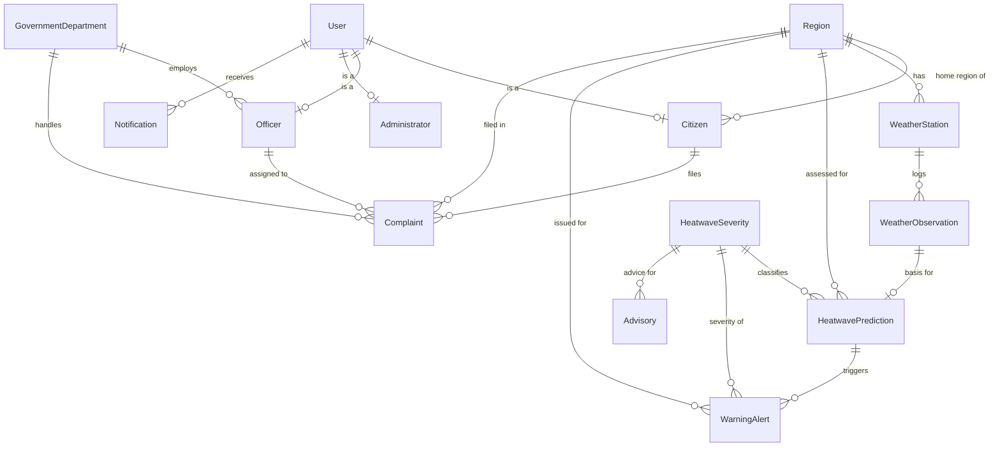

# HeatGuard

We built this for our DBMS lab project. It's a heatwave complaint and early
warning system: weather readings come in, a simple rule-based check classifies
how severe the heat is, citizens get warned and can file complaints, and
officers/admins track and resolve them.

> **Live demo:** https://palakagrawal-git.github.io/DBMS_mini_project/
> This is a client-side build using sql.js (real SQLite running in the
> browser), so the schema, trigger and view all work exactly like the Flask
> version below, just without needing Python installed. Refresh to reset the
> data.

## What it does

- Officers/admins log weather readings (temperature, humidity, wind) per station.
- A rule-based classifier turns the latest reading into a severity level
  (Low/Moderate/High/Extreme) for that region.
- High/Extreme readings automatically raise a warning alert (via a DB trigger)
  and citizens in that region get notified.
- Citizens can file complaints (water shortage, power cuts, heat illness, etc.)
  tied to their region.
- Officers/admins assign complaints to a department/officer and move them
  through Open → In Progress → Resolved. Complaints in higher-severity regions
  are shown first.
- A reports page has a few Chart.js charts (complaints by status/region,
  severity distribution, prediction trend) plus a region risk list.
- Admins get table row counts and CSV export for every table.

## Tech used

- **Backend:** Python (Flask)
- **Database:** SQLite (`heatwave.db`)
- **Frontend:** Jinja2 templates + Bootstrap 5
- **Charts:** Chart.js

## How to run

```bash
# optional venv
python -m venv venv
venv\Scripts\activate        # Windows
# source venv/bin/activate   # macOS/Linux

pip install -r requirements.txt
python init_db.py            # creates the schema + seed data
python app.py
```

Then open <http://127.0.0.1:5000>.

Re-run `python init_db.py` any time to reset the database. Use
`python init_db.py --schema` for an empty schema with no seed data.

### Demo accounts (password: `pass123`)

| Username   | Role          | Notes             |
|------------|---------------|-------------------|
| `admin`    | Administrator | full access       |
| `officer1` | Officer       | Water Supply dept |
| `officer2` | Officer       | Health dept       |
| `priya`    | Citizen       | Nagpur            |
| `rahul`    | Citizen       | Vidarbha East     |
| `sana`     | Citizen       | Akola             |
| `dev`      | Citizen       | Chandrapur        |

## ER Diagram



Each `User` row is exactly one of Citizen/Officer/Administrator (1:1 sub-type
tables off the base User table, so login stays in one place). A Region has
many weather stations, predictions, alerts and complaints. `HeatwaveSeverity`
and `Advisory` are lookup tables so severity levels and advisory text aren't
duplicated everywhere.

## Severity rules

Located in `expert_system.py`. It's a basic rule-based classifier, not
machine learning (that's intentional for this course):

| Severity  | Rule                                               |
|-----------|-----------------------------------------------------|
| Extreme   | temp ≥ 45°C, or (temp ≥ 40°C and humidity ≤ 20%)     |
| High      | temp ≥ 40°C                                          |
| Moderate  | temp ≥ 35°C                                          |
| Low       | below 35°C                                           |

The result is saved to `HeatwavePrediction`. When severity is High or
Extreme, the `trg_prediction_autowarn` trigger automatically inserts a
`WarningAlert` row for that region — no Python logic needed for that part.

The schema also has one view, `v_region_complaint_summary`, which gives the
total/open/in-progress/resolved complaint counts per region. It's used on
both the admin and officer dashboards instead of running that join twice.
The schema is normalized to 3NF — lookup tables for severity/department
avoid repeating text, and the Citizen/Officer/Administrator split keeps
role-specific columns out of the base User table.

## Limitations

- Weather data is dummy/seeded, there's no real weather API hooked up.
- The "AI" part is rule-based thresholds, not a trained model.
- The Flask `SECRET_KEY` in `app.py` is a dev placeholder, not for real use.
